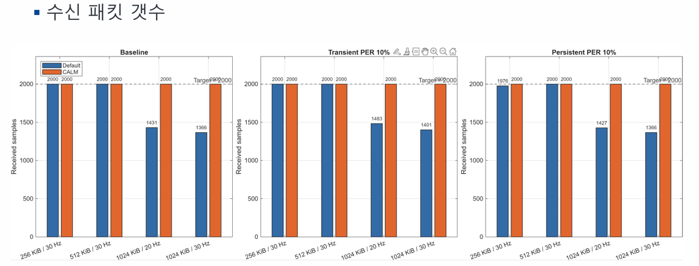
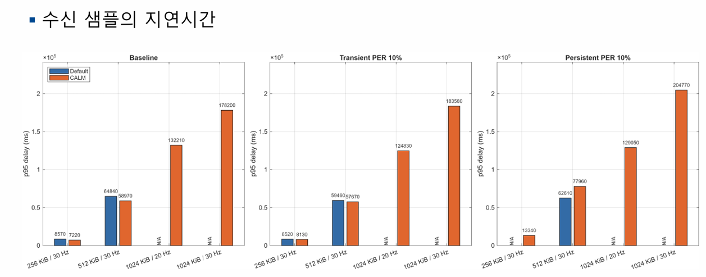
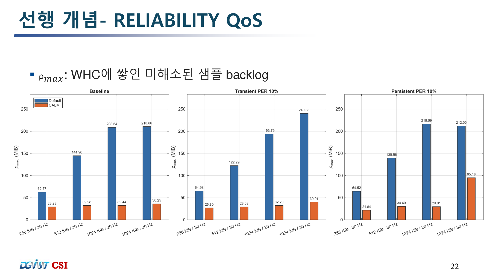

# CALM 4.3: Concentration-Aware Loop Modulation for ROS 2 DDS

CALM은 ROS 2 DDS의 `RELIABLE` QoS에서 대량 repair가 한꺼번에 release되어
추가 손실, 반복 NACK, 긴 지연을 만드는 positive feedback을 억제하는
Writer-side 재전송 제어 메커니즘입니다. 현재 공개 구현은 **Fast DDS 2.6.11용
CALM 4.3**이며, RTPS wire format과 Reader 구현을 변경하지 않습니다.

> **현재 상태:** Fast DDS 구현과 loopback 검증이 완료되었습니다. 재전송 budget
> 제어는 구현됐으며, payload와 링크 조건에 일반화되는 pacing 주기 설계는 진행 중입니다.
> Cyclone DDS 구현은 아직 배포하지 않습니다.

## 1. 연구 배경 및 연구 동기

Reliable RTPS는 Writer가 `DATA/DATA_FRAG`를 전송하고, `HEARTBEAT`에 대한
Reader의 `ACKNACK/NACKFRAG`를 바탕으로 누락 데이터를 복구합니다. 손실된
sample은 ACK으로 확인될 때까지 Writer History Cache(WHC)에 남습니다.

```text
Writer                                      Reader
  | --- DATA / DATA_FRAG --------------------> |
  | --- HEARTBEAT ---------------------------->|
  | <--- ACKNACK / NACKFRAG ------------------ |
  | --- requested repair --------------------> |
  | <--- cumulative ACK progress ------------- |
```

무선 손실이나 링크 단절 후 요청된 repair를 한꺼번에 release하면 재전송 자체가
링크를 다시 포화시킬 수 있습니다. 추가 손실은 더 많은 NACK과 repair burst를
만들고, 이 과정이 반복되면 WHC의 미해소 repair debt와 지연이 함께 증가합니다.

```text
혼잡/손실 -> NACK 증가 -> repair burst -> 추가 링크 포화
    ^                                      |
    +----------- 추가 손실/지연 <----------+
```

실험에서는 [Optimizing ROS 2 Communication for Wireless Robotic Systems](docs/paper/Optimizing_ROS_2_Communication_for_Wireless_Robotic_Systems.pdf)의
다음 최적화를 Optimized Default와 CALM 양쪽에 동일하게 적용합니다. 즉 OPT 1·2는
통제변인이고 CALM controller만 조작변인입니다.

- **OPT 1:** RTPS `maxMessageSize=1472 B`
- **OPT 2:** periodic HEARTBEAT 주기를 publish period의 절반으로 설정

## 2. CALM이란?

CALM은 **Concentration-Aware Loop Modulation**의 약자입니다. WHC에 남은 repair
debt의 농도와 재전송 실패를 관측하고, 한 pacing opportunity에 release하는
byte budget을 조절해 신뢰성 피드백 루프를 안정화합니다.

### 목적과 설계 원칙

- **관측:** WHC의 미해소 repair debt 변화와 가장 오래된 sample의 재전송 실패를 추적
- **조절:** Writer별·Reader별 budget을 AIMD 방식으로 조절하고 oldest repair부터 release
- **목표:** sample을 버리지 않으면서 repair burst와 WHC 적체를 낮추고 전달을 완료
- **자율성:** DDS layer 외부의 링크 용량 입력이나 Reader 수정 없이 동작
- **무결성:** RTPS wire format을 바꾸지 않고 `KEEP_ALL`의 전달 의무 유지
- **강건성:** payload, 발행률, 손실률이 달라져도 같은 관측·제어 원리를 적용하는 것을 목표

### 생물학적 영감

CALM은 사이토카인 농도가 과도하게 증가할 때 억제 반응이 강화되는 생체의 음성
피드백에서 영감을 얻었습니다. RTPS에서도 repair debt가 해소되지 않고 증가하면
재전송 budget을 줄여, 재전송 자체가 다음 손실을 만드는 양성 피드백을 누릅니다.

### CALM 4.3 제어식

각 valid repair-feedback round에서 진입 후보를 다음과 같이 정의합니다.

$$
C_n = (U_n \ge \bar{S}) \land (\Delta U_n \ge 0)
      \land (\Delta F^{old}_n \ge 1)
$$

$C_n$이 2회 연속 성립하면 해당 ReaderProxy의 CALM episode가 시작됩니다.

$$
D_n = \mathrm{CALM\_ACTIVE}
      \land (\Delta F^{old}_n \ge 1)
      \land (\Delta U_n \ge 0 \lor T_{ACK,n} \ge T_{to,n})
$$

$$
I_n = \mathrm{CALM\_ACTIVE}
      \land (R^{ACK}_n > 0)
      \land (\Delta U_n < 0)
$$

```math
p_n = \mathrm{clip}\left(
\frac{R^{\mathrm{reNACK}}_n}
{\max\left(R^{\mathrm{released}}_n,1\right)},
0,1
\right)
```

```math
q_n = \mathrm{clip}\left(
\frac{R^{\mathrm{ACK}}_n}
{\max\left(R^{\mathrm{released}}_n,1\right)},
0,1
\right)
```
$$
B_{n+1}=
\begin{cases}
\max\left(B_{min},B_n(1-K_dp_n)\right), & D_n \\
\min\left(B_{max},B_n+K_iq_n\bar S\right), & I_n \\
B_n, & \text{otherwise}
\end{cases}
$$

$$
G_n = (U_n \le \bar S) \land (\Delta U_n < 0)
      \land (\Delta F^{old}_n = 0)
$$

$G_n$이 2회 연속 성립하면 NORMAL로 돌아갑니다. 단, $U_n=0$이면 다음 repair
feedback이 생기지 않으므로 즉시 복귀합니다. 실패 비율 $p_n$이 클수록 budget을
곱셈 감소하고, ACK 복구 비율 $q_n$이 클수록 sample 크기에 비례해 budget을
덧셈 증가합니다. 각 pacing에서는 가장 오래된 repair에 budget을 먼저 배정하고,
repair가 모두 release된 뒤 남은 budget으로 held-new를 보냅니다.

### 기호

| 기호 | 의미 |
| --- | --- |
| $n$ | valid repair-feedback round |
| $U_n$ | NACK된 뒤 cumulative ACK으로 해소되지 않은 WHC repair byte |
| $\Delta U_n$ | $U_n-U_{n-1}$ |
| $\bar S$ | ReaderProxy가 관리하는 serialized sample의 평균 크기 |
| $F^{old}_n$ | 가장 오래된 repair sample의 누적 failed-repair 횟수 |
| $\Delta F^{old}_n$ | 현재 round에서 증가한 oldest failed-repair 횟수 |
| $C_n$ | CALM 진입 후보 조건 |
| $D_n$ | budget 감소 조건 |
| $I_n$ | budget 증가 조건 |
| $G_n$ | NORMAL 복귀 후보 조건 |
| $B_n$ | 한 pacing opportunity의 총 release budget |
| $B_{min}, B_{max}$ | budget 하한과 상한 |
| $K_d, K_i$ | 감소·증가 gain |
| $R^{released}_n$ | round에서 release한 repair byte |
| $R^{reNACK}_n$ | release 후 다시 NACK된 repair byte |
| $R^{ACK}_n$ | ACK으로 해소된 repair byte |
| $p_n, q_n$ | 재실패 비율과 복구 비율 |
| $T_{ACK,n}$ | 마지막 cumulative ACK 진전 이후 경과시간 |
| $T_{to,n}$ | ACK 정체 판정 timeout |
| $T_p$ | pacing release 간격 |

현재 기본 계수는 $K_d=K_i=0.25$입니다. budget 범위는 평균 sample 크기를
사용해 $B_{min}=\max(128\,\mathrm{KiB},0.25\bar S)$,
$B_{initial}=\max(512\,\mathrm{KiB},\bar S)$,
$B_{max}=\max(2\,\mathrm{MiB},2\bar S)$로 설정합니다. CALM 4.3 검증에서는
$T_p=T_{HB}$를 사용하며, 일반화된 pacing 결정식은 아직 연구 중입니다.

## 3. 실험

### 실험 조건 및 설계

- DDS: Fast DDS 2.6.11, Reliable, `KEEP_ALL`
- 비교: OPT 1·2 + CALM OFF vs. OPT 1·2 + CALM 4.3 ON
- 전송: UDP loopback, 180 Mbps, delay `3 +/- 1 ms`
- sample 수: 조건별 2,000개
- workload: `256 KiB x 30 Hz`, `512 KiB x 30 Hz`,
  `1,024 KiB x 20 Hz`, `1,024 KiB x 30 Hz`
- Baseline: 인위적 packet loss 없음
- 일시 손실: 200번째 sample 이후 PER 10%를 20초간 적용 후 복구
- 지속 손실: 실험 시작부터 종료까지 PER 10%
- 제한시간: 300초
- 주요 지표: 수신 sample 수, p95 end-to-end delay, 최대 repair debt $U_{max}$

### 수신 sample 수



Baseline과 두 손실 조건에서 CALM은 모든 workload의 2,000개 sample을 수신했습니다.
Default는 1,024 KiB 고부하 조건에서 1,366~1,483개에 머물렀고, 지속 손실의
256 KiB 조건에서도 1,976개만 수신했습니다.

### p95 end-to-end delay



CALM은 256 KiB·512 KiB의 baseline과 일시 손실에서는 Default와 비슷하거나 더 낮은
p95를 보였습니다. 지속 손실의 512 KiB에서는 `62.61 s -> 77.96 s`로 악화했으며,
1,024 KiB의 Default 값은 timeout으로 완전 수신하지 못해 직접 비교할 p95가 없습니다.

### 최대 WHC repair debt



CALM은 12개 비교 조건 모두에서 $U_{max}$를 낮췄습니다. 대표적으로 baseline
`1,024 KiB x 20 Hz`는 `208.64 MiB -> 32.44 MiB`, 일시 손실의 같은 workload는
`193.79 MiB -> 32.20 MiB`로 감소해 repair burst 억제 효과를 확인했습니다.

> 이 결과는 loopback/netem 환경의 proof of concept입니다. 특히 1,024 KiB 조건의
> CALM p95도 120초 이상이므로 완전 수신과 폭주 억제에는 성공했지만 실시간성을
> 달성한 결과로 해석해서는 안 됩니다.

## 4. 구현과 사용

현재 배포 코드는 [`CALM/fastdds-v2.6.11`](CALM/fastdds-v2.6.11)에 있습니다.
`CALM.patch`는 권장 설치 방식이고, `overlay/`는 수정 파일의 정확한 snapshot입니다.

```bash
git clone --branch v2.6.11 https://github.com/eProsima/Fast-DDS.git Fast-DDS
cd Fast-DDS
git apply /path/to/this-repository/CALM/fastdds-v2.6.11/CALM.patch
```

ROS 2 Humble workspace에서 Fast DDS와 `rmw_fastrtps_cpp`를 다시 빌드한 뒤,
[`docs/experiments/CALM4.3`](docs/experiments/CALM4.3)의 자동화 코드를 사용할 수
있습니다. 상세 파일별 역할과 환경변수는 [`CALM/README.md`](CALM/README.md)를
참고하십시오.

## 5. Repository Layout

```text
CALM/fastdds-v2.6.11/       # current CALM 4.3 patch and overlay
docs/
  assets/results/           # presentation result figures
  experiments/
    CALM4.1/                # archived CALM 4.1 experiment package
    CALM4.3/                # current Fast DDS validation package
    pre-CALM/S1/            # initial baseline experiment
  history/
    CALM3/                  # CALM 3 reports
    CALM4.0/                # CALM 4.0 patches and manifest
    CALM4.1/                # CALM 4.1 code, README, and reports
  paper/                    # referenced paper
```

대용량 raw CSV와 ROS 2 `build/install/log` 산출물은 저장소에 포함하지 않습니다.

## 6. Next Work

- **Cyclone DDS에 CALM 구현:** Cyclone 고유의 retransmit queue와 backpressure 경로에 공통 CALM 제어 의미를 연결합니다.
- **Pacing 설계:** DDS layer 관측값으로 workload와 링크 변화에 일반화되는 $T_p$ 결정식을 설계하고 검증합니다.

## 7. Target Conference

**IEEE/IFIP Network Operations and Management Symposium 2027**

- Venue: Montreal, Canada
- Expected submission deadline: October 15, 2026
- Past submission date: October 13, 2025(NOMS 2026)

<!--## License

CALM의 Fast DDS 파생 파일에는 upstream Fast DDS 라이선스가 그대로 적용됩니다.
연구 코드와 문서의 재사용 시 원 프로젝트와 본 저장소를 함께 인용해 주십시오.-->
